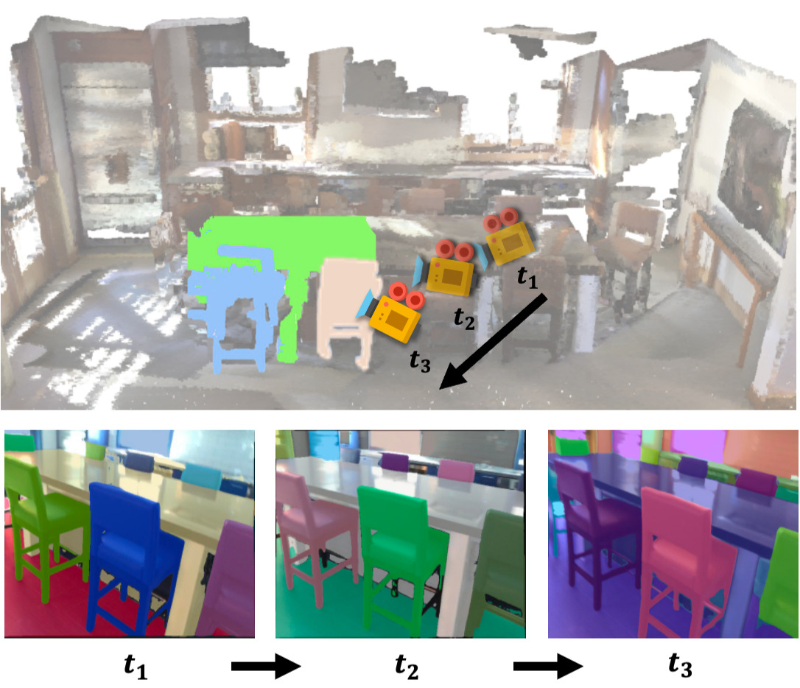
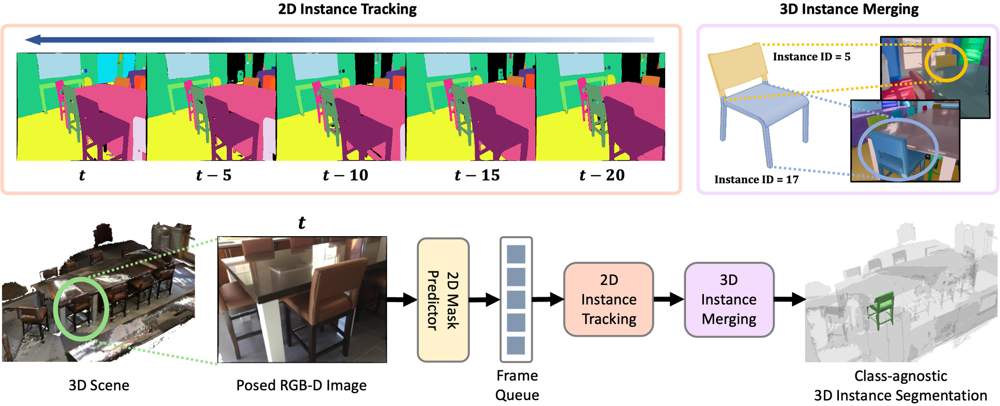

<div align="center">

# CDIS: Cross-Dimensional Class-Agnostic 3D Instance Segmentation via 2D Mask Tracking and 3D-2D Projection Merging

**Juno Kim**<sup>1\*</sup> · **Hye-Jung Yoon**<sup>1\*</sup> · **Yesol Park**<sup>1\*</sup> · **Byoung-Tak Zhang**<sup>1</sup>

<sup>1</sup>Interdisciplinary Program in AI, Seoul National University
<br><sub>\*Equal contribution</sub>

**IEEE/RSJ IROS 2025**

<a href="https://ieeexplore.ieee.org/document/11247636"></a>&nbsp;
<a href="https://arxiv.org/abs/2607.17778"></a>&nbsp;
<a href="https://github.com/teamROBI/CDIS"></a>&nbsp;
<a href="LICENSE"></a>&nbsp;




</div>

> **TL;DR:** CDIS produces globally consistent, class-agnostic 3D instance segmentation by
> explicitly **tracking** 2D instance masks across frames and associating them with 3D superpoints
> — a feedback loop between 2D and 3D that fixes the fragmented identities of project-and-merge
> pipelines, with **no 3D-specific training**.

## Abstract

Class-agnostic 3D instance segmentation is critical for robotic systems operating in unknown
environments, enabling perception of previously unseen objects for reliable manipulation and
navigation. Existing approaches typically project per-frame 2D instance masks into 3D and merge
them, which often breaks object identities across time and yields fragmented 3D instances. We
introduce **Cross-Dimensional Class-Agnostic 3D Instance Segmentation (CDIS)**, a zero-shot
framework that explicitly tracks 2D instance masks across frames and associates them with 3D
superpoints, creating a feedback loop between 2D and 3D. This cross-dimensional reasoning links
temporally stable 2D tracks with spatially coherent 3D regions, producing globally consistent 3D
instance labels without any 3D-specific training. Experiments on benchmark datasets demonstrate
that CDIS achieves higher accuracy and consistency than state-of-the-art zero-shot methods, while
remaining efficient and scalable to diverse real-world environments.

## Method



CDIS produces 3D instance segmentation in three stages:

1. **2D Instance Tracking** — Per-frame 2D instance masks (from a class-agnostic 2D model) are made
   temporally consistent by warping past frames into the current frame with the relative camera
   pose and matching instances by 2D mask IoU over a sliding frame queue (`CDIS/matching_2d.py`).
2. **3D-Guided 2D Instance Merging** — Precomputed 3D superpoints are lifted against the tracked
   masks and merged by 3D IoU, associating instances across frames through geometric consistency
   (`CDIS/merging_3d.py`, `CDIS/merge_ops.py`).
3. **3D Instance Consolidation** — Duplicate assignments are resolved through 3D
   intersection-over-minimum and temporal co-occurrence analysis, followed by DBSCAN cleanup and
   intensity-weighted voxel voting, yielding a unified per-point 3D instance labelling.

## Contents
- [Installation](#installation)
- [Data](#data)
- [Usage](#usage)
- [Results](#results)
- [Repository layout](#repository-layout)
- [Citation](#citation)
- [Acknowledgements](#acknowledgements)
- [License](#license)

## Installation

Tested with **Python 3.10, PyTorch 1.11.0, CUDA 11.3** on Linux with an NVIDIA GPU.
Dependencies are managed with [uv](https://docs.astral.sh/uv/) and pinned in `uv.lock`:

```bash
curl -LsSf https://astral.sh/uv/install.sh | sh   # if you don't have uv
uv sync                                           # creates .venv/ with the locked dependencies
```

That is everything needed to run the pipeline on precomputed 2D masks (the default). Generating
masks yourself additionally needs detectron2 + CropFormer, which compile CUDA extensions — see
[docs/INSTALL.md](docs/INSTALL.md) for those steps and for the checkpoint download.

## Data

CDIS is evaluated on **ScanNet200**. The expected `data/` layout and the preprocessing steps
(posed RGB-D, mesh over-segmentation, synthetic depth, 2D masks, evaluation ground truth) are
documented in [docs/DATA.md](docs/DATA.md). `data/` and `output/` are local directories (or
symlinks) and are not tracked by git.

## Usage

The pipeline runs from the repository root.

```bash
# 1. Build 3D instance predictions (tracked 2D masks -> 3D merge -> consolidation)
#    bash scripts/build_CDIS.sh [CONFIG] [GPU] [PART] [SUBPROCESS_NUM]
bash scripts/build_CDIS.sh scannet200 0 0 1

#    ...or split across two GPUs:
bash scripts/build_CDIS.sh scannet200 0 0 2 &   # GPU 0, first half
bash scripts/build_CDIS.sh scannet200 1 1 2 &   # GPU 1, second half

# 2. Evaluate class-agnostic AP / AP50 / AP25
#    bash scripts/run_eval.sh [PRED_DIR] [GT_DIR]
bash scripts/run_eval.sh
```

Key hyperparameters (`configs/scannet200.yaml`):
`queue_size (q_max)=5`, `iou_2d_th (τ_IoU2D)=0.75`, `iou_3d_th (τ_IoU3D)=0.5`,
`iom_3d_th (τ_IoMin3D)=0.6`, `iom_frame_th (τ_co)=0.3`, `vis_threshold=0.05`.

## Results

### ScanNet200 (validation, class-agnostic 3D instance segmentation)

| Method           | 2D Model   | AP       | AP50     | AP25     |
|------------------|------------|----------|----------|----------|
| SAM3D            | SAM        | 20.2     | 35.7     | 55.5     |
| Open3DIS         | SAM        | 31.5     | 45.3     | 51.1     |
| MaskClustering   | CropFormer | 19.2     | 36.6     | 51.7     |
| OV-MAP           | CropFormer | 29.9     | 49.4     | 67.5     |
| CDIS (paper)     | CropFormer | 33.2     | 52.1     | 69.2     |
| **CDIS (this repo)** | CropFormer | **35.8** | **54.6** | **69.9** |

Baseline rows and the CDIS paper row are as reported in the paper (Table I). The last row is what
this repository produces on the full ScanNet200 validation set (312 scenes) with the shipped
`configs/scannet200.yaml` — run it as described under [Usage](#usage). The pipeline itself is
deterministic, so repeated runs of a fixed config in the same environment agree; exact values may
differ slightly with other library or hardware versions.

## Repository layout

```
CDIS/          core pipeline: run.py, matching_2d.py, merging_3d.py, merge_ops.py, segment_instances.py
utils/         data IO, 3D geometry, point-cloud / superpoint loaders
configs/       scannet200.yaml
evaluation/    self-contained class-agnostic AP evaluator + runner
scripts/       build_CDIS.sh (run the pipeline) and run_eval.sh (evaluate)
assets/        ScanNet200 validation scene list
libs/          vendored CropFormer/Entity; detectron2 is installed separately
weights/       model checkpoints (downloaded, not committed)
docs/          INSTALL / DATA guides + figures
visualization/ optional helpers for inspecting depths, RGB and 2D tracking
```

Vendored code under `libs/` is adapted from the upstream projects listed under
[Acknowledgements](#acknowledgements) and retains their original licenses.

## Citation

```bibtex
@inproceedings{kim2025cdis,
  title     = {CDIS: Cross-Dimensional Class-Agnostic 3D Instance Segmentation via 2D Mask Tracking and 3D-2D Projection Merging},
  author    = {Kim, Juno and Yoon, Hye-Jung and Park, Yesol and Zhang, Byoung-Tak},
  booktitle = {2025 IEEE/RSJ International Conference on Intelligent Robots and Systems (IROS)},
  pages     = {4269--4274},
  year      = {2025},
  organization = {IEEE}
}
```

## Acknowledgements

CDIS builds on [CropFormer / Entity](https://github.com/qqlu/Entity),
[Pointcept](https://github.com/Pointcept/Pointcept), and the ScanNet evaluation toolkit. It
extends our earlier project [OV-MAP](https://github.com/teamROBI/OVMap). We thank the authors for
releasing their code.

## License

Released under the [MIT License](LICENSE). Vendored third-party components remain under their
respective licenses.
